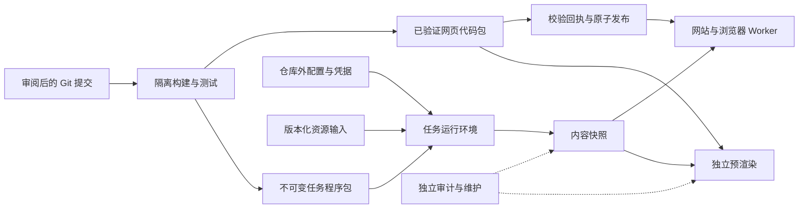

# 开发、内容生产与发布

本流程与 `CONFIGURATION_POLICY.md` 一起使用。真实配置不进 Git，线上生效配置作为迁移初始基线。代码、内容快照、程序和持久状态分别交付。共享计分模块位于 `packages/scoring`；浏览器个人计算继续在浏览器/Worker 运行，公共派生结果在内容生产端计算。



## 开发与交付入口

- 每项任务使用独立分支；并行开发使用独立 worktree，避免把他人的未完成修改打包。
- PR 验证不下载整套游戏资源。CI 使用已提交的合成样例及计分回放样例，执行来源检查、依赖安装、离线测试和独立网页构建。
- 本地预览：先执行 `npm --prefix site ci`，再执行 `bash scripts/build-web-client.sh --preview output/code-preview`。输出目录必须尚不存在；再次预览使用新的目录名。预览清单明确标记 `local-preview`，正式发布入口拒绝此产物。
- 正式候选：`bash scripts/build-web-client.sh --candidate HEAD output/code-candidate`。运行环境使用 Node 22.22.0 与 Python 3.12（见 CI）。必须在干净检出上执行，指定提交必须等于 HEAD。
- 原有完整静态资源构建脚本保留给资源回放/旧版本维护；网页代码正式交付统一走上述候选入口。

候选构建器只复制 Git 已跟踪且通过脱敏检查的文件到临时隔离目录，不读取原工作区的忽略文件。依赖按 `site/package-lock.json` 安装，执行固定测试命令，再构建候选。构建前后检查源码指纹，所有命令成功才生成验证回执。没有游戏装饰图时使用项目自己的品牌图形；没有专有 Live2D Core 时不打包它。真实游戏媒体和专有运行库仍须由独立内容/运维流程提供。 预渲染的加载角色图从本次固定的内容快照选择，确认文件存在后才生成 URL，页面切换和工具加载共用这份映射；缺图时使用代码包必带的 `loading/brand-fallback.svg`。冷启动入口继续内嵌图形，不依赖额外内容查询。CI 的加载资源测试同时检查干净构建产物、内容缺图回退及实际导航入口。

`code-release.json` 记录文件摘要、Git 提交和 tree、源码文件指纹、依赖锁摘要、Node/npm/Python 版本。`verification.json` 绑定完整代码清单和 HTML 摘要，并记录实际执行的固定测试命令、退出码与输出摘要。测试输出不打进公开产物，避免意外带入敏感信息。每次正式验证分配独立运行 ID，计入代码身份；同一提交重新验证也产生新的发布身份，避免不同回执争用同一个不可变目录。源码指纹仍可用于比较是否同源。

验证回执是执行记录，不是数字签名。发布者必须从受信任的 CI 运行摘要或自己完成的本地验收取得 `verification.json` 的 SHA-256，并通过独立参数固定它；不能把下载文件自行声称的 `passed: true` 当作授权。GitHub 工作流上传代码包和程序包，预览与生产晋级同一份代码包，发布时不重新构建。

从已成功的受信任 CI 运行下载产物，替换以下运行编号与完整提交号：

```sh
gh run download RUN_ID --repo stonesver/otonote \
  --name verified-candidates-COMMIT \
  --dir output/reviewed-RUN_ID
```

解包结果为 `output/reviewed-RUN_ID/code-candidate/` 和 `output/reviewed-RUN_ID/runtime-candidate/`。从同一个成功运行的 Summary 获取代码回执与程序包两个 SHA-256；核对该运行的提交号和审查版本一致。发布时将下文 `--source` 改为下载的 `code-candidate` 目录，程序安装使用下载的 `runtime-candidate`，不重新构建晋级产物。下载目录应为新的空目录，避免混入旧产物。

## 本地源码与私有资料分开保存

公开工作副本是唯一日常开发入口。原始资源、实际配置、SDK、历史 Git、旧工作区快照和验收记录放在仓库外的受限私有目录；不要把旧工作区整棵复制回源码目录。

干净工作副本可完成固定离线测试和独立代码预览。完整资源生产还需要角色对应的 Python 依赖及外部运行材料；仅安装 Node 依赖不代表解包链路已就绪。Python 虚拟环境按当前解释器重新创建，避免迁移旧环境后其启动器仍指向已退役路径。

有私有内容快照时，可用独立预览服务组合它与新代码：

```sh
python3 tools/preview_independent_site.py \
  --code output/code-preview \
  --content /PRIVATE_CONTENT_STORE \
  --port 4392
```

该入口不写内容快照，修改源码后需构建新的预览目录并重启预览服务。`npm run dev` 属于依赖本地资源配置和生成数据的旧 Astro 开发入口，不是干净检出的默认验收方式。

QQ 渲染器可按需从私有资源目录将字体材料化到 `backend/qqbot/fonts/`；本地 TTF 文件已忽略，不随源码或 CI 上传。历史归档与当前运行资料分开管理；归档内旧路径只用于追溯，不应批量改写已封存回执。恢复历史资料时先查看对应迁移清单和链接映射。

## 程序不可变交付

```sh
python3 -m tools.runtime_bundle build --revision HEAD --output output/runtime-candidate
python3 -m tools.runtime_bundle verify --root output/runtime-candidate --expected-sha256 REVIEWED_RUNTIME_SHA256
```

程序包采用确定性允许清单，只包含更新器、发布器、渲染器相关的工具源码、共享计分模块、依赖锁和公开产品契约。它不包含真实配置、输入、缓存、游戏资源、账号 SDK 参数或 `node_modules`。`runtime.json` 记录包内文件、源码身份和契约。

安装时把程序包放到以 `runtime.json` 摘要命名的版本目录。先验证这个未挂载状态/配置的原始包，再运行基础镜像。迁移已有生产实例时，**保留原容器程序根、工作目录、状态根和内容路径**：历史 `state.json`、decoder 记录和候选回执可能保存绝对路径，不能仅把新文档里的 `/app` 当成迁移目标。

将现有持久状态根一次性挂载到原容器状态根，使工作输出与内容库保留在同一个挂载对象内。程序根可以是状态根的子目录；将固定程序版本中的 `tools/`、`analysis/`、`backend/`、`packages/` 分别只读覆盖到原程序根同名目录，显式保持原 `--workdir`。配置目录单独只读覆盖到原程序根的 `config/`。外部配置目录须包含所需私有配置及包内公开 `config/site-product.json` 契约；已有公开契约与新包不同时先审查差异，不静默覆盖。新环境可自行选择 `/app` 等路径，但本流程不自动重写历史状态或搬迁输入。

不要把工作输出和内容库分成两次 bind mount，即使它们位于同一块宿主磁盘，也可能导致跨挂载硬链接失败。它们可以是程序根内的 `output/` 和程序根旁的内容目录，前提是都位于同一次状态根挂载中。保留这一布局是为了兼容现有资源流水线的 ROOT 相对路径及硬链接发布机制，同时让程序目录保持只读。不得将可写状态根本身作为程序来源。

Python/Node/系统工具由另行审查的 digest 固定基础镜像提供；程序包本身不伪装成包含这些依赖的完整镜像。新版更新器程序包仅支持内容生产，完整旧网站构建不在此包契约内。基础镜像、状态根、程序包根、配置根和容器参数属于私有部署配置，均不能写入公开仓库。
切换程序版本前先运行现有预检，确认基础镜像依赖和外部资源契约满足要求；再对照旧版本执行样例任务。预检还须显式检查 `OURNOTES_MASTER_SALT_HEX`、`OURNOTES_MASTER_KEY_HEX`、`OURNOTES_MASTER_IV_HEX` 各为 32 字节，以及非零的 `OURNOTES_CRI_KEY`；`doctor(build=True)` 的依赖检查不能替代这些材料检查。真实值通过仓库外的受限 env 文件传入更新容器，不放入源码、镜像层或命令行。只读渲染容器不需要这些解密材料。

当前资源解码还需通过 `OURNOTES_BUNDLE_DECODER_PROFILE` 指向只读外置 JSON。字段契约为 `schemaVersion: 1` 与 `profiles` 数组；每项包含 `clientVersion`、`metadataSha256`、整数 `keyFieldUsage` 和 `nonceSeedFieldUsage`。实际版本、摘要与字段映射由私有资源验证流程提供，不提交真实文件。配置必须精确匹配待用客户端和元数据，旧索引不能自动回退到新版本；缓存命中也必须重新校验绑定。该文件不含复制出的密钥，运行时只从已验证元数据解析材料。

预检以原工作目录、原路径和新只读程序覆盖运行，状态挂载也设为只读，并禁用网络，验证 import、依赖、私有输入存在及路径绑定。记录程序摘要与基础镜像 digest，保留旧单元、原配置和上个版本用于回滚。预检成功不等于生产已切换；需在单次真实任务和两服渲染验证后才宣称不可变程序交付已在线生效。不得继续在活动版本目录覆盖源码。

## 发布设置与执行

维护者本机的现有网页部署配置位于 `/Users/stone/Documents/data/otonote/private/deployment/code-deploy.json`。该路径仅用于定位本地文件；实际配置内容继续保存在仓库外，不复制进源码或发布产物。执行发布时通过 `--config` 指定此文件。

`tools.deploy_code` 只读取检出目录外、权限为 `0600` 的私有 JSON。仓库不存这份文件；结构如下，全部值由部署操作者在受保护位置填写：

```json
{
  "sshHost": "DEPLOY_SSH_ALIAS",
  "codeRoot": "/ABSOLUTE_CODE_STORE",
  "runtimeRoot": "/ABSOLUTE_VERSIONED_PROGRAM_DIRECTORY",
  "python": "/ABSOLUTE_PYTHON_EXECUTABLE",
  "runtimeSha256": "REVIEWED_RUNTIME_SHA256",
  "healthUrl": "https://deployment.example.invalid/HEALTH_RESOURCE",
  "healthContains": "{codeId}"
}
```

`runtimeRoot` 指向已安装的固定程序包；发布前通过本地发送的独立 Python 标准库校验程序验证其完整库存及固定摘要，验证成功前不导入远端程序包。健康检查使用操作者指定的地址及响应内容。地址和匹配内容可用 `{codeId}` 替换当前候选 ID；应检查实际服务正在返回候选版本的入口或健康资源，不能只验证一个无关的 200 页面。

私有配置中的 `python` 必须实际支持程序包及其依赖。旧宿主 Python 3.6 能运行独立摘要引导检查，却不能运行当前发布器；不能以引导检查成功推断部署可用。应提供经过验证的现代宿主解释器，或由受保护的固定基础镜像启动器提供同等参数与挂载契约，再做发布演练。

```sh
bash scripts/publish-web-client.sh \
  --source output/code-candidate \
  --config /PRIVATE_DIRECTORY/code-deploy.json \
  --receipt-sha256 REVIEWED_VERIFICATION_SHA256 \
  --expected-current CURRENT_CODE_ID \
  --dry-run
```

`--dry-run` 只做本地产物及配置结构校验，不连接或验证远端运行环境。移除 `--dry-run` 才执行上传、远端验证和切换。首次安装的 `--expected-current` 使用 `none`。发布锁覆盖旧版本检查、安装、指针切换和健康检查；如果当前版本已经变化，候选不会切换。健康检查失败时恢复原 current/previous 指针。没有旧版本的首次安装失败会移除新 current 指针。

前端包的 HTTP 健康检查和真实用户验收是不同关卡：发布后仍需检查预渲染组合、CDN、主要页面及浏览器交互。只有源码和内容都通过相应验收，才记录为完成发布。预渲染仍引用旧代码/内容时不能立即回收旧版本。

## CI 与验收边界

`.github/workflows/check.yml` 保留公开仓库原有 gitleaks 历史扫描和公开测试，增加来源边界、固定离线门禁、官方候选和程序包上传。PR 不持有生产凭据，不自动部署。

固定候选门禁包含发布并发锁、旧指针保护、失败回滚、HTML 和包完整性、来源变更、缺失/伪造验证记录、配置混入拒绝、浏览器内容契约和共享计分/Worker 回放。完整游戏资源回放、线上更新及真实客户端验收单独记录，不能用离线测试通过替代。

内容发布的 `content_derivatives.mjs` 用运行时编译器检查公开成员技能等级与留影突破等级，输出 `supplemental/scoring-compatibility.json`（实际文件位于 `_supplemental/`）。报告列出卡片、等级及缺失机制或数据；它是计算覆盖诊断，不阻断资料发布。参考综合力排行跳过卡片技能，不能单独证明卡片技能兼容性。

激奏执行按歌曲任务筛选技能，然后分别编译条件与效果，沿用统一生命周期和底层控制器。新增技能 ID、数值或已有机制的组合无需添加逐技能分支。真正缺少的相关机制仅排除受影响的配对，推荐页面显示覆盖限制；缺失数据和程序异常仍作为错误终止，不伪装成机制缺口。必选条件不会被放宽，不能完整计算的队伍不参与分数和差值。

候选的 `performance-planning` 门禁包含机制组合、候选隔离、兼容性报告和错误状态回归；`tests.test_content_publication` 验证未知机制会随内容发布报告，不阻断新资料，也不会丢失旧版本指针。这些检查不代替新技能组合的实机数值验收。

已有工作区的大量未提交成果应通过脱敏选择、差异审查进入现有公开仓库的分支，不应整体重置、把完整私有历史推送公开仓库，或把忽略文件临时强制添加来通过构建。
