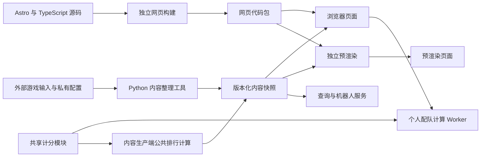

# OtoNote 技术概览

OtoNote 将网页代码、游戏内容和动态服务分开组织。网页负责展示与交互，Python 工具将资源整理成可校验的内容快照，独立服务提供查询、管理与机器人能力。更新一份游戏资料不必重新编译全部网页代码。

本文帮助首次阅读源码的人找到入口。构建、正式候选和部署细节以[开发流程](DEVELOPMENT_WORKFLOW.md)为准，依赖来源见[第三方项目说明](../THIRD_PARTY_NOTICES.md)。

## 从输入到页面



例如，打开一首歌曲时，页面根据当前区服与语言加载对应快照中的曲目信息；尝试个人配队时，浏览器把所选卡片、养成和计分输入交给计算模块。公共歌曲排行则在内容生产阶段生成，作为版本化资料提供给页面。

工具页面的初始 HTML 直接包含当前布局；交互脚本只绑定状态与行为，不先生成旧版页面再搬运控件。预渲染和浏览器冷启动均在数据及模块准备完成后开放工具，失败时保留重载提示。

## 代码地图

| 路径 | 职责 | 阅读入口 |
| --- | --- | --- |
| `site/src/pages/` | Astro 页面与路由 | [关于页面](../site/src/pages/about/index.astro)、角色、音乐、剧情和工具页面 |
| `site/src/layouts/`、`components/`、`styles/` | 页面框架、组件与样式 | [BaseLayout](../site/src/layouts/BaseLayout.astro)、[SiteFooter](../site/src/components/SiteFooter.astro) |
| `site/src/lib/` | 内容类型、区服上下文、交互与展示逻辑 | [catalog](../site/src/lib/catalog.ts)、[site-context](../site/src/lib/site-context.ts) |
| `site/src/runtime/` | 独立代码包的内容加载、页面渲染和启动 | [content](../site/src/runtime/content.mjs)、[boot](../site/src/runtime/boot.mjs) |
| `packages/scoring/` | 浏览器和内容生产共同使用的计分实现 | [共享计分说明](../packages/scoring/README.md) |
| `tools/resource_pipeline/` | 版本探测、输入处理、转换、校验和发布 | [cli](../tools/resource_pipeline/cli.py)、[pipeline](../tools/resource_pipeline/pipeline.py) |
| `tools/` | 目录投影、媒体处理、构建、发布和运维工具 | [独立网页构建](../tools/build_web_client.mjs)、[内容发布](../tools/content_publication.py) |
| `analysis/` | Unity、媒体、二进制与计分研究辅助工具 | [依赖入口](../analysis/requirements.txt)；不进入普通页面请求链路 |
| `backend/` | 查询 API 与持久状态 | [app](../backend/app.py)、[query](../backend/query.py) |
| `backend/qqbot/`、`backend/admin/` | 机器人适配、图片渲染与管理服务 | [机器人入口](../backend/qqbot/app.py)、[管理入口](../backend/admin/app.py) |
| `packaging/growth-tool/` | 本机运行的养成导出工具 | [工具说明](../packaging/growth-tool/README.md) |
| `tests/`、`site/tests/` | Python 与 Node 验证 | 使用合成样例的离线检查，以及需另行提供资源的集成检查 |

## 个人演出与配队

配队页将卡片范围、培养目标、玩家发挥和推荐方向交给 `production-optimizer-worker`。规划入口调用 `team-planning-optimizer`，先检查培养变体，再用 `practical-optimizer` 生成并复算候选。不同方向比较整队结果，支配方案和重复队伍不另占一张推荐卡。

纯计算来自共享包的 `growth-scenarios`、`performance-scenarios` 和 `performance-scenario-calculator`。普通、激奏及挑战适配共享输入；收益模块从分数估计档位再换算活动收益。个人搜索没有新增后端接口。详情回放与推荐沿用相同发挥条件；预设保留计划语义，更新实际卡库后重新计算差额。

用户说明见[使用指南](USER_GUIDE.md)，设计范围和验收条件见[演出与配队设计](plans/2026-10-04-performance-and-team-planning-design.md)。

## 网页与内容如何配合

页面使用 Astro 模板和 TypeScript。仓库保留传统 Astro 静态投影构建，但公开源码的默认预览入口是 `scripts/build-web-client.sh --preview`。它编译页面、交互脚本及 Worker，不读取整套游戏快照。共享样式和品牌信息由网站层统一管理。

独立运行时根据 URL 的区服、语言和路由选择资料。`content.mjs` 读取当前内容指针，再验证清单与文件的 SHA-256；同一文档的后续加载复用同一快照，避免页面中途混入另一个版本。资料的结构还由页面侧的内容契约校验。

独立预渲染将已构建代码与指定快照组合为 HTML。源码构建通过、内容通过校验、浏览器行为正确和生产发布成功是不同结果，验证记录应分别说明。

服装图鉴使用同一快照的 `costumes.json`，按 `MasterCharacterCostumeGroup` 分组，关联模型路径和成员卡。图标经 Sprite 裁切后进入独立服装媒体目录，模型复用 Live2D 清单。新网页通过可选投影兼容旧内容；文件已声明但摘要或版本错误时仍拒绝加载。完整输入管线版本 3 会为旧版本 2 的输入生成新的隔离候选，避免遗漏新增服装图标。

列表主图使用离线生成的全身 WebP，不导入 Live2D 播放器或自动下载模型。`costumePosterInputs` 将图片目录及其 manifest SHA-256 绑定到输入计划；每张图还绑定分组、角色、modelPath 和 sourceSha256。模型源变化时不复用旧图。生成器 `python -m tools.costume_poster_server` 只绑定本机，使用单独提供的 Core 和本地内容库，在浏览器中逐个渲染并封存图片；生成过程中依然验证全部模型资源摘要。新造型需先补齐图片输入，再验收内容候选。

## 计算和媒体

共享计分模块接收明确的规则、谱面和编成输入，纯计算部分不依赖 DOM、网络或部署配置。浏览器和 Web Worker 用它计算个人方案，内容生产端用同一实现生成公共派生结果。Node 专用的文件读取适配器不应引入浏览器页面。

Live2D 预览使用 PixiJS、`pixi-live2d-display` 和另行提供的 Cubism Core。演出场景使用 Three.js 与 Spine Runtimes。资源处理侧使用 UnityPy、WannaCRI、FFmpeg 和 vgmstream 等工具。各项功能是否可用还取决于对应版本的资源与运行库，源码中有入口不代表所有素材都随仓库提供。

## 服务与配置

Python 服务使用 FastAPI / Uvicorn；SQLite 用于查询数据库及服务状态，机器人回复图片使用 Pillow 与适用字体。查询、管理、机器人及资源更新器有不同的依赖和运行材料，不应把所有 `requirements` 文件当作一个环境一次性安装。

真实账号、SDK 参数、资源密钥、内容目录和生产部署配置由仓库外提供。仓库内保留示例与契约，具体边界见[配置与脱敏政策](CONFIGURATION_POLICY.md)。技术介绍不会公开真实主机、路径、凭据或私有数据。

## 本地开始

需要 `.nvmrc` 对应的 Node.js 22.22.0，以及 Python 3.11+（CI 使用 Python 3.12）。在仓库根目录运行：

```sh
nvm use
npm --prefix site ci
bash scripts/build-web-client.sh --preview output/web-client-local
python3 -m tools.code_publication --source output/web-client-local --verify-only
```

输出目录必须是新的目录。构建完成只代表代码包就绪；在浏览器展示完整站点还需要一个符合内容协议的内容库，例如自行准备并发布到 `output/preview/content` 的快照：

```sh
python3 tools/preview_independent_site.py \
  --code output/web-client-local \
  --content output/preview/content \
  --port 4340
```

随后访问 `http://127.0.0.1:4340/global/zh-CN/`。上面的内容目录不是克隆后自动生成的示例数据，不能用空目录获得完整站点。`npm run dev` 仍需要本地数据投影与版本配置，不能代替缺少快照时的独立构建。

基础离线检查、贡献流程见[参与贡献](../CONTRIBUTING.md)。正式候选的固定验证、不可变产物与发布流程见[开发流程](DEVELOPMENT_WORKFLOW.md)，运行期维护见[运行维护](OPERATIONS.md)。

## 共用卡库与队伍浮窗

`team-workspace-store` 按区服长期保存命名队伍和最近草稿，使用稳定队伍 ID 与修订号；内容版本只用于校验，不作为队伍库身份。`personal-growth-store` 继续保存实际卡库和账号养成，培养目标仅存在队伍中。旧预设迁移由玩家明确选取来源，保留旧记录。

`shared-team-context` 是工具页与浮窗的接口：读取或应用队伍、声明限制、作废计算结果。它保留页面歌曲与活动条件，并监听同页养成通知和跨标签页变化。已打开的工具持有各自工作副本，不会因另一页换队而自动改队。`team-workspace-compatibility` 共用禁用原因与输入检查，活动加成不得被转为硬限制。

`SharedTeamWorkspace` 只挂载轻量入口，首次打开才加载浮窗和卡库管理；非计算工具通过 `shared-team-data` 按需读取当前内容快照。`shared-inventory-panel` 负责实际养成、导入预览与撤销；`shared-team-workspace` 负责命名队伍、配对、队长和培养场景编辑。所有个人数据仍保存在浏览器，不新增账号数据后台。
