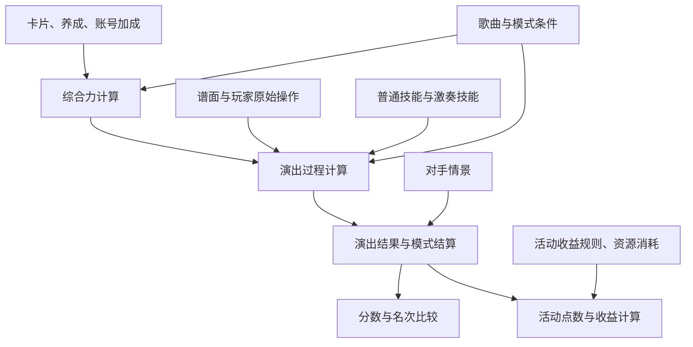

# 演出计分、激奏配队与养成方案设计

日期：2026-10-04

状态：设计稿；作为分阶段实施与验收的依据，不代表下述功能已经完成。

## 1. 要解决的问题

OtoNote 需要把演出计算做得足够细，让自由演出、挑战演出、激奏以及后续活动能够共用可靠的计算能力。同时，玩家不应为了配一队卡，先填写大量参数或读懂计分公式。

这份设计覆盖四件相互关联的事：

1. 准确计算综合力、局内技能、玩家操作和模式规则如何共同产生分数。
2. 根据玩家的发挥和目标，提供有不同取舍的激奏配队与曲池预设。
3. 同时支持未导入卡库、按当前养成配队，以及比较养成后的队伍。
4. 用直观的默认流程、逐层展开的说明和自然的玩家用语呈现结果。

计算需要精细，操作需要省事。底层增加一个参数，不意味着页面增加一个输入框。

## 2. 已确定的设计原则

- 自由演出作为共用计分基础的主要验收场景；其他模式在明确的计算环节加入规则。
- 综合力加成、局内计分、名次结算、活动点数与道具收益分别处理，避免混用。
- 玩家表现是正式输入；AP 是一种计算情景，不是所有玩家的默认事实。
- 一键配队保留有实际取舍的方案，不用单一分数排序替玩家决定玩法。
- 卡库导入是便利功能，不是使用配队工具的前提。
- 卡片持有情况、实际养成、计划养成分开保存；计算假设不得覆盖实际记录。
- 默认页面只要求必要输入；影响结论的重要假设简短可见，技术细节按需展开。
- 每条推荐说明都应对应计算事实，明确说明适用条件、好处和代价。
- 游戏规则、推荐偏好和搜索限制分开表达。推荐器的默认取舍不能伪装成游戏限制。
- 规则依据、代码验证、模拟结果和实机对照分别记录，不互相替代。

## 3. 当前实现与需要补齐的部分

本节依据当前工作区源码检查。它说明可复用的能力，不构成完整机制审计或实机验收。

| 现有实现 | 已具备的能力 | 本设计要求补齐的部分 |
| --- | --- | --- |
| `packages/scoring/scoring-rules/formation-power.mjs`、`formation-input.mjs` | 综合力计算、所选卡／已拥有／理论卡池、养成参数 | 核实各项来源与计算顺序，统一当前养成和计划养成的输入方式 |
| `packages/scoring/scoring-rules/formal-performance-replay.mjs` | 普通演出逐判定输入、连击、生命、部分动态技能回放 | 完善已发布规则覆盖，让配队评价使用同样的演出输入 |
| `packages/scoring/scoring-rules/event-rules.mjs` | 按综合力、歌曲、音符得分、固定得分、活动点数、收益等环节应用规则 | 逐个活动核对适用环节、叠加及取整，避免重复加成 |
| `packages/scoring/scoring-rules/gekisou-song-score.mjs`、`gekisou-frame-replay.mjs` | 激奏条件 AP 模拟、技能与任务状态、名次情景、抽样 | 与玩家操作模型衔接，完善非理想发挥下的机制验证 |
| `site/src/lib/practical-optimizer.mjs` | 从综合力、普通技能、任务类型等方向生成候选 | 让方向体现在最终方案与解释中，审视当前最多一张扩窗卡等推荐限制 |
| `site/src/lib/preset-portfolio.mjs` | 曲池内比较预设、部分养成假设 | 区分实际与计划，支持玩家表现差异，说明预设切换条件 |
| `site/src/components/GekisouBattleLab.astro` | 三段结构、手填实验事件与研究入口 | 明确其与共用演出计算的关系，避免正式计算与手填实验相互混淆 |

当前仓库规则基线涉及的 13 种激奏效果类型和 10 种条件类型均出现在计分器支持集合中。这只说明类型已被接纳，不等于每种组合、状态变化和结算边界均已验证。

当前普通演出明确判定回放和激奏 AP 模拟仍有不同输入假设。不能只把两者放进同一个页面，就宣称已经支持任意发挥的激奏计算。

## 4. 共用演出计算

### 4.1 计算关系

这是职责划分，不要求把现有代码全部重写。优先复用共享模块，把重复规则逐步集中到同一个实现。

### 4.2 综合力

完整梳理成员卡与留影卡三维、颜色属性、歌曲属性、擅长曲目、TGWCard、角色评级、乐队道具和其他已有账号加成。挑战演出对指定卡、乐队或属性的综合力加成在此处理，不与活动掉落加成混在一起。

每个来源应能回答：作用于谁、取哪个基础值、在何时叠加、如何取整、受到什么上限或条件限制。不能只验证最终总数接近。

输入区分卡片养成和账号条件。假设一张卡练好，不自动提升角色评级、TGWCard 或乐队道具；这些变化只有在方案明确选择后才参与计算。

未来活动按实际规则接入。属于综合力的修改放在综合力环节；改变判定、技能、音符计分或结算的规则进入对应环节，不强行折算成综合力。

### 4.3 局内过程

演出计算需要保留：谱面事件、原始操作、有效判定、连击、生命、技能状态、每次计分以及模式事件。

重点核对：

- GREAT、GOOD、BAD、MISS 等判定如何影响得分、连击、生命与后续技能条件。
- 技能触发、持续、结束、叠加、次数消耗、累积与重置的先后顺序。
- 同时输入、段落边界、技能边界、延迟结算及数值取整。
- 普通技能和激奏技能共同作用时的行为。

基础计算输出既包含整场结果，也能按需给出逐事件记录。批量推荐先计算必要摘要，仅在用户展开方案时生成详细过程。

### 4.4 得分与收益

得分比较使用演出结果。活动收益在此基础上继续应用活动点数、掉落、体力或其他资源消耗规则。

冲高分、争名次、提高单位资源收益和减少耗时是不同目标。收益目标应明确分母，例如每次演出、每单位体力或每分钟；已有收益计算继续复用，不另建一套底层计分。

模式内的排名奖励属于演出结算。活动道具掉落属于收益计算。两者不得因为都叫“奖励”而使用同一加成。

## 5. 玩家表现

### 5.1 两种输入方式

| 输入 | 用途 | 要求 |
| --- | --- | --- |
| 指定的一次演出 | 复盘、精确换卡比较、核对机制 | 记录逐事件判定或操作时机、输入顺序和必要情景条件 |
| 表现情景 | 日常推荐、稳定性比较 | 由偏差、波动、易失误区段等条件生成多次演出，保留生成依据 |

同样数量的 GREAT 或同样的整体准确率，不能替代具体出现位置。难段集中失误、技能窗口内失误和其他位置的失误需要能区分。

FC 情况不能直接推定 JUST 水平。歌曲和难度不同，也不应机械套用同一个表现结论。

### 5.2 公平比较不同技能

比较队伍时，尽量固定玩家原始操作，再分别应用各队的判定窗口、转换、生命与计数效果。不得固定技能作用后的 JUST 比例，再用它评价改善 JUST 的技能。

只有结果页判定统计时，无法唯一还原原始操作。此时可作为粗略情景依据，但应说明估算范围。明确判定文件与原始时机输入要区分：前者在信息不足时不能支持完整的扩窗效果比较。

随机抽样比较使用相同的玩家表现样本集合，并分别标识玩家波动、技能顺序、游戏随机和对手情景。相同随机种子只保证可复算，不保证不同队伍的每次随机事件能一一对应。

### 5.3 页面上的表达

首次使用不要求逐音符配置。可直接用标注清楚的参考情景查看结果，也可以选择“通常能连完”“难段容易断”等少量描述，并按需补充 JUST 表现。此类描述只选择模拟情景，不伪装成经过测量的个人水平。

理想发挥保留为显式选项，供玩家查看上限方向。默认参考情景的具体数值需要随规则版本记录并经过代表性案例验证；未完成这种验证时，展示明确的参考条件，不输出“适合你的水平”等个人判断。

长期偏好可以记住；某首歌的难段和熟练程度允许单独调整。高级入口再提供逐判定、时钟和其他技术条件。

## 6. 卡片范围与养成场景

### 6.1 分开选择“用哪些卡”和“按什么养成算”

底层将两个维度分别保存，页面用常见场景组合它们，避免玩家面对两大组交叉参数。

卡片范围包括：当前选择的卡、手动标记已拥有的卡、导入的卡库、加入指定试用卡后的卡池、当前区服规则版本支持的参考卡池。

养成条件包括：已知实际养成、明确标注的参考养成、保持当前突破等条件的等级／技能提升、指定卡的目标养成，以及全满养成参考。

卡片是否已持有、养成是否已知、是否允许在计划中提升分别记录。导入缺少一张卡，不自动等于玩家没有它；未填写养成也不等于等级为零或已经练满。

### 6.2 首批提供的场景

| 页面选项 | 适用情况 | 计算方式与结果标识 |
| --- | --- | --- |
| 先看参考队伍 | 没有卡库，想了解搭配 | 在当前区服支持的参考卡池内，使用公开说明的养成与账号条件；标为参考队伍，不声称玩家能直接使用 |
| 用我选的卡 | 不想导入，只想比较几张卡或当前十张卡 | 搜索仅限已选范围；可批量设置参考养成，也可填写实际值 |
| 按当前养成配队 | 已导入或手动填写卡库 | 使用已知实际值；缺失值需要排除或明确采用参考值，不能混称为实际状态 |
| 看看练好后怎么配 | 已持有一些尚未养成的卡 | 实际状态不变，在计划副本中提升允许的卡，展示目标与当前方案的差别 |
| 试试这张卡 | 想比较一张新卡或暂未持有的卡 | 加入明确选定的试用卡和目标养成；标出持有未知或尚未持有，不自动加入实际卡库 |

导入入口与手动选择、参考队伍并列可达。页面空态不只显示“请导入卡库”。

未导入时，先提供“先看参考队伍”和“用我选的卡”。已有资料时默认“按当前养成配队”，旁边提供“看看练好后怎么配”。

### 6.3 养成后的方案如何生成

首版用少量明确选项控制计划：

- 默认保持当前突破、觉醒等已知状态，只将允许的卡提升到当前条件下的等级上限；普通技能与激奏技能的目标独立记录。
- 页面快捷选项可以同时设置等级和技能，但必须简短写明提升了哪些项目；进入卡片详情可改目标。
- 玩家可以指定愿意培养的卡，或限制“最多再练 1 张／2 张”；成员卡和留影卡均计入该限制。
- 一张卡只要有任一养成字段超过实际状态，就算一张需要培养的卡。多项提升不重复计数。
- 突破、觉醒、稀有材料消耗与账号条件提升不默认为免费可得；需要玩家明确选择相应目标。
- “全满养成”作为单独参考选项，不用作所有培养方案的默认条件。

计划搜索须让这些已持有但尚未养成的卡参与候选生成，不能先按当前综合力把它们筛掉，再只对留下的队伍提高等级。

限制培养卡片数量只是便捷约束，不能替代材料预算。两张卡所需材料可能不同。

### 6.4 比较与材料信息

培养方案与当前方案分开展示。对于有实际数据的玩家，至少提供：

1. 当前卡库能得到的方案。
2. 计划队伍在当前养成下的表现。
3. 同一计划队伍达到目标养成后的表现。

这样可以区分重新配对的收益和养成提升的收益。没有当前资料时，只展示目标情景，不编造“比你现在提高多少”。

每套培养方案列出需要培养的卡、具体字段变化、涉及的歌曲或激奏段，以及表现变化。只有材料规则与来源完整时才展示准确消耗；只有玩家填写了可用材料后，才判断能否立即完成。

首版不承诺完整材料背包或全局最省材料路线。没有成本依据时可以说“需要培养 2 张卡”，不能说“低成本”“最划算”或“材料够用”。后续材料预算模块可复用目标差额和收益计算。

### 6.5 保存与更新

养成假设保存在预设或计算情景中，不回写实际卡库。“应用队伍”只切换当前编成，不代表卡片已获得或已完成养成。

重新导入卡库后，更新实际资料；计划仍保留其目标，并重新计算未完成的部分。达到目标的卡不再计入待培养数量。资料版本不兼容或字段不完整时提示修正，不静默套用旧数值。

## 7. 激奏机制与技能评价

### 7.1 先把机制说明完整

每类 COMBO、LUCK、JUST 效果需要记录：触发条件、作用对象、数值、持续或次数、累积、叠加、上限、释放与重置、段落边界和结算顺序。技能等级与成员／留影配对条件也要进入同一份规则说明。

规则条目同时记录依据：主表参数、原生逻辑、模拟测试、实机对照。未确认部分明确限制适用范围，不能仅凭技能文本猜测组合行为。

### 7.2 歌曲适配

激奏段是推荐的重要依据，但不能只数三段里各有几段。需要结合：

- 段落类型、顺序、时长和其中的有效判定事件。
- 玩家在该段的准确程度与断连风险。
- 技能能触发几次，生效是否过晚，是否达到上限，是否有剩余次数。
- 普通技能与激奏技能的时间关系。
- 歌曲属性、擅长曲目、乐队与配对条件带来的综合力和技能变化。

段数和类型可用于快速筛选；最终评价使用真实谱面与演出计算。不能用“某类段落占三分之二”直接推出其技能价值占三分之二。

### 7.3 技能价值由情景决定

同一技能在不同操作、队伍、歌曲和对手下可能有不同收益。通过对照计算回答：

- 同一操作，换卡或换留影后发生了什么。
- 同一队伍，发挥改善或某段失误后发生了什么。
- 哪种发挥条件下，两种搭配的优劣会改变。
- 技能增加的是音符得分、任务计数，还是通过改变名次带来的结算分数。

不预先给“人的操作”和“技能”分配固定百分比；用情景变化衡量敏感程度。重叠技能覆盖的分数不能直接相加成单卡贡献，换卡结果按整队比较。

### 7.4 分数与名次

自由冲分看自己的结果；争第一还需要对手条件。对手卡组相近，也不意味着任务计数和名次相同，更不意味着合理配对失去价值。

未提供对手时，展示自己的计数与得分，以及名次变化时的结果。固定名次时明确提示抢名次收益没有完整计入，不把固定第一名当作个人实战预测。

提供对手情景后可以比较争夺名次的效果；只有具备明确的对手样本或分布依据时，才给出对应情景的胜率估计。样本来源和适用条件需要可查看。

## 8. 多方向配队与曲池预设

### 8.1 推荐目标

| 方向 | 评价重点 | 必须解释的代价 |
| --- | --- | --- |
| 冲高分 | 较好发挥下的得分潜力 | 对操作、技能顺序与随机结果的依赖 |
| 求稳定 | 常见及较差发挥情景的结果 | 牺牲了多少得分潜力，改善来自哪里 |
| 争段落名次 | 任务计数及相应对手条件下的名次变化 | 哪些段落受益，是否降低其他得分 |
| 多首歌通用 | 有限预设对指定曲池的覆盖 | 哪些歌仍值得换专用队伍 |

活动收益是另一项目标，复用演出结果与已有收益模块。养成前后是计算场景，可以与上述方向组合，不单独强制命名为一种“流派”。

### 8.2 候选生成与最终选择

综合力、普通技能、激奏类型、判定改善等特征用于生成多种候选；再用统一演出计算比较。计划养成参与候选生成阶段。

默认显示最多三套有实质差异的方案。方向不同但得到同一队时合并；某套在所有已选评价项都更差且没有用户偏好理由时，不为凑数量保留。

保留卡片锁定、成员与留影配对锁定、技能偏好和候选排除。默认不要求玩家填写各项权重；专业权重与搜索范围放在高级入口。

扩窗卡数量等规则分清性质：游戏合法性必须遵守；玩家偏好应保留；计算量或推荐策略造成的限制应说明。当前推荐中的单扩窗卡限制需要在技能叠加核查后重新设计，不能直接当成普遍最优结论，也不能未经验证就假设多张一定有效。

未完成的搜索可以提供当前已找到的方案，但需标出“已比较的方案中”。停止、恢复和输入变化后的结果失效都应可预测，不展示与新条件不一致的旧结果。

### 8.3 预设与选歌

玩家可以保存当前可用队伍和培养计划，设定自己愿意维护的预设数量。曲池比较说明每套队伍适合哪些歌曲、激奏类型和发挥条件。

选歌后优先显示现有预设中合适的队伍及切换原因，再按需重新搜索。培养未完成的预设要标明，不与现在可用的预设混排成同一类。

曲池等权只表示比较时同等对待各曲，不代表服务器选歌概率。若玩家自行设置常玩歌曲权重，应随预设保存。

## 9. 页面流程

### 9.1 默认流程

选择歌曲或曲池 → 选择卡片与养成场景 → 选择目标 → 查看方案 → 应用或保存。

沿用已有区服、语言、歌曲和卡库上下文；已有内容自动带入，避免重复选择。首次用户不必导入卡库或填写完整账号加成就能查看参考结果。

默认区展示必要选择和当前条件摘要，例如“手选卡 · 等级按当前上限 · 技能按设定目标”。摘要应来自实际计算输入，不能写死成宣传语。

### 9.2 三层信息

| 层次 | 内容 | 使用方式 |
| --- | --- | --- |
| 直接使用 | 歌曲、卡片场景、目标、少量方案 | 默认可见 |
| 调整方案 | 锁卡、培养目标、发挥描述、技能偏好、预设数量 | 结果旁就地调整或展开 |
| 深入研究 | 逐音符、具体对手、输入时钟、随机设置、规则证据 | 独立高级入口，可保存研究情景 |

技术字段不进入默认操作流程；影响结论的假设不能只藏在高级入口。高级场景应有“恢复参考设置”，并能识别当前存在自定义条件。

### 9.3 方案卡片

首屏只呈现：队伍、适用情况、主要比较结果、关键取舍和下一步按钮。培养方案额外显示需要练哪些卡。

按需展开：配对条件、分段得分、技能发动、养成差额、计算条件与依据。展开前不同时渲染全部时间轴和逐音符列表。

“应用队伍”“保存预设”“对比两队”“修改培养目标”使用具体动词。两队对比优先呈现变化，不重复两份完整表格。

### 9.4 操作与状态

- 手机端能完成选卡、调整目标、计算、比较和保存，不依赖悬停说明或横向大表。
- 类型图标和颜色同时配文字；关键结论不能只靠颜色表达。
- 键盘可完成主要操作，展开与错误状态有清楚的焦点和提示。
- 计算显示真实阶段、允许取消，保留输入；没有可用方案时指出具体约束冲突。
- 卡片、养成或表现条件变化后明确要求重新计算，不继续把旧结果当作当前答案。
- 缺少关键规则时停止受影响的计算；仍可使用的查询、选卡与预设功能保持可用。

## 10. 页面用语

用玩家熟悉的名称，先说结论，再给原因。句子短一些，不反复使用“综合考量”“多维赋能”“智能最优”“打造闭环”等空泛说法。

不把内部对象名、算法阶段、原生函数名和统计术语直接当作按钮或推荐标题。也不刻意卖萌、不替玩家做性格判断，不使用“高手必备”“新手只能用”等标签。

| 避免 | 建议写法 |
| --- | --- |
| 基于多维协同效应生成最优策略 | 这队更适合这首歌的两个 JUST 段。 |
| 资源禀赋不足，建议优化养成路径 | 这套队伍还需要练好 2 张卡。 |
| 技能前置依赖未满足 | 这张留影需要配指定乐队的成员，当前没有生效。 |
| 推荐稳健型解决方案 | 这队在难段失误时掉分较少，但顺利打完时分数稍低。 |
| 理论收益显著提升 | 练到所列目标后，这队在当前条件下的分数更高。 |
| 数据缺失导致无法执行 | 还没填卡库。可以先选几张卡，或看看参考队伍。 |

示例是写法，不是固定结论；只有计算支持时才能使用。“掉分较少”需要相同失误情景的对照，“分数更高”需要同条件比较。

说明靠近对应选择或结果，不在页面顶部堆放一整篇机制说明。未发动原因尽量给出明确条件；无法判断时直接说缺少哪项信息，不用一长串“可能”代替解释。

数值说明使用合适精度。样本最好成绩不叫理论最高分，抽样低分不叫保底；未掌握个人材料或对手情况时不声称能完成培养或保证第一。

## 11. 模块与数据约定

### 11.1 模块职责

| 模块 | 接收 | 返回 |
| --- | --- | --- |
| 综合力 | 卡组、有效养成、账号与歌曲条件、适用活动规则 | 总综合力、分项、来源与版本 |
| 演出过程 | 综合力、谱面、技能、原始操作或明确判定、模式情景 | 得分、生命、连击、任务状态和可选过程记录 |
| 模式结算 | 演出结果、对手与确认条件 | 名次、模式奖励、最终分数 |
| 收益 | 演出与结算结果、活动收益规则、资源消耗 | 活动点数、道具或效率指标 |
| 配队与养成搜索 | 卡片范围、实际与计划养成、玩家情景、目标与锁定条件 | 多方向候选、比较结果、搜索完成情况 |
| 页面说明 | 结构化结果与原因 | 简短说明、条件摘要、详情入口 |

实际模式中，结算事件可能影响后续演出状态，不能把所有模式处理一律推迟到曲终。模块通过明确事件协作，共享同一条时间线；上表是职责划分，不是要求每个环节只能运行一次。

### 11.2 必须保存的语义

- 规则区服、内容版本、算法版本、谱面身份。
- 卡片范围、持有状态、实际养成来源与缺失字段。
- 计划目标、允许提升的卡、卡数或已明确的材料约束。
- 玩家情景的输入种类、参数来源、歌曲适用范围。
- 技能顺序、随机抽样、对手条件及模式结算假设。
- 推荐目标、锁定条件、候选范围和搜索完成情况。
- 结果、比较基线、可追溯的推荐原因和验证状态。

上述是语义要求，实施时沿用现有数据结构演进，不提前固定大量新字段。缓存与恢复记录必须包含会改变结果的这些条件；养成目标或表现情景改变后不得复用旧结果。

预设保存队伍与情景，不存成一份看似已经实现的账号状态。旧预设可以补充明确默认值后迁移；语义无法恢复的部分提示用户确认，不能默默改成满养成。

### 11.3 执行位置

共享计算继续放在 `packages/scoring`。个人配队在浏览器 Worker 中运行，公共参考数据沿用内容生产流程；本设计不要求新增账号后台或在线计算服务。

规则适配以实际存在的自由、挑战、激奏和活动差异为依据。首阶段不为假想模式建立通用脚本语言或任意规则编辑器。

## 12. 方案选择与实施顺序

可以先改页面，让现有能力更易用；也可以先扩展激奏模拟。但前者无法补齐计算条件，后者容易让普通演出、养成和配队继续使用不同假设。

采用分阶段完善共用计算、再接入推荐的方式。每阶段独立验收，并同步改进所涉及的页面，不等到所有底层工作结束才检查可用性。

| 阶段 | 交付 | 完成标准 |
| --- | --- | --- |
| 一：共用演出基础 | 综合力来源与规则审计、明确操作回放、活动适用环节、技能覆盖清单 | 能解释一次演出的结果，并对换卡、改变活动条件或一次失误给出可核对的差异 |
| 二：卡片与养成场景 | 无卡库入口、当前／参考／计划状态、指定培养卡和目标比较 | 未导入也可使用；计划不污染实际数据；未养成卡能参与推荐 |
| 三：玩家表现与激奏 | 操作情景、技能交互验证、任务计数与名次比较 | 相同操作下可比较不同队伍，能区分直接得分与抢名次收益 |
| 四：多方向推荐与预设 | 少量有差异的方案、曲池覆盖、自然说明、按需详情 | 玩家能理解主要取舍、快速调整、保存并在选歌时使用 |

第二阶段可先使用已验证的演出范围交付，不必等待完整激奏支持。各阶段不得把尚未接入的模式显示成已经支持。

实施任务按纵向可使用的功能拆分，例如“手选卡并比较一个培养目标”，而不是一次重写全部计算、再一次重写全部页面。具体界面布局在各阶段实施设计中确定，本文件固定行为与验收要求。

## 13. 验证与验收

### 13.1 计算验证

- 综合力：覆盖卡片三维、歌曲关系、账号条件和活动叠加的代表性组合与取整边界。
- 普通演出：同一谱面在 AP、分散 GREAT、难段集中失误、不同位置断连等输入下逐事件核对。
- 技能：触发、叠加、消耗、结束、生命条件、判定转换和同刻事件顺序均有独立依据。
- 激奏：三类任务、混合段落、边界输入、技能交互、名次变化与结算分别验证。
- 活动：同一个加成不在综合力与收益重复应用，新增规则不改变无活动场景。
- 依据：合成测试保证实现行为，原生对照核查具体逻辑，实机样本确认可观察结果；报告分别标明。

### 13.2 场景与推荐验收

| 场景 | 必须成立 |
| --- | --- |
| 未导入卡库 | 能手选或查看参考队伍，不被导入提示拦住 |
| 卡库养成不完整 | 缺失与实际零值、默认值分开；结果说明采用了什么假设 |
| 未养成卡养成后适合入队 | 计划搜索可以找到它，明确列出目标，不要求它先在当前养成筛选中胜出 |
| 只愿意练一张卡 | 返回方案满足限制，不能隐含提升其他卡或账号条件 |
| 比较当前与计划 | 区分当前最合适队伍、计划队伍当前表现、计划队伍培养后表现 |
| 多卡技能互相依赖 | 保留合法组合，不把效果当作完全独立的单卡分数相加 |
| 比较扩窗与加分 | 相同原始操作下分别计算有效判定；缺少时机数据时说明比较限制 |
| 争激奏段落名次 | 固定名次与提供对手时的结论能够区分 |
| 多方向得到同一队 | 合并展示，不凑三张重复方案卡 |
| 重新导入或升级规则 | 保留计划意图，重新计算差额；旧结果不冒充当前结果 |
| 搜索取消或预算耗尽 | 输入保留，结果注明搜索范围与未完成状态 |

### 13.3 页面验收

用不了解公式的玩家任务检查，而不只看组件测试：

1. 不导入卡库，选一首歌并得到参考方案。
2. 手选已有卡，对比现在使用与培养一张卡后的队伍。
3. 从两套激奏方案中看懂适用差异，锁定喜欢的卡并重新计算。
4. 保存当前队伍与培养计划，换歌后知道选哪套。
5. 在手机上完成以上流程，必要时查看技能原因，再顺利返回结果。

验收关注默认需要填写多少项、是否出现被迫进入高级设置的步骤、能否识别实际与假设养成、是否看得懂主要取舍。检查中文与英文、键盘操作、加载失败、无可用方案和取消状态。

产品文案逐条人工审读：删掉不能对应事实的形容词、空泛总结和重复免责声明；保留会改变选择的重要条件。

## 14. 本设计的范围

本设计确定共用计算、玩家情景、养成计划、多方向推荐及页面呈现原则。它不承诺已经完成所有机制验证，不要求首版支持材料背包全量优化，也不预测未来尚未出现的玩法。

本次交付为设计文档。后续按阶段核对已有实现、细化任务并验收；功能真正改变后再同步使用指南和技术文档，避免把计划写成已上线能力。
